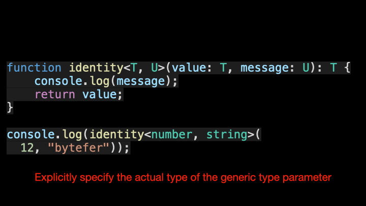

# Features

## How to run this project.
Using  below command line to build typescript to javascript, then you will have lib directory contains all javascript code after build
```
  npx tsc --watch
```
Run typescript project
```
ts-node src/index.ts | npm start 
```

## What we need to know:
### Types:
- Tuple: Array fixed number of elements, it's can be difference types
Eg: let dimension: [number, number, string] = [0, 0, "Hello"];


- Template literal: ability to expand into many strings via unions
[Look at the below example](/src/types/template-literal.type.ts)
Refer at [@link](https://www.typescriptlang.org/docs/handbook/2/template-literal-types.html)
```
type Size = 'small' | 'medium' | 'large';
type Color = 'primary' | 'secondary'
type ButtonStyle = `${Size}-${Color}`;


// Make strict literal type, catch error if pass wrong type
function applyButtonStyle(style: ButtonStyle) {
  //................
}

applyButtonStyle('small-primary');
applyButtonStyle('medium-primary');
// applyButtonStyle('medi-primary') //Error typo type
```

### Convention naming for generic type like K, V, T, and E
Actually, you can use arbitrary naming for generic, but we have a convention for developers can more understand what the type which you represented
- K, V (Key, Value): represents the type of key, value in the object
- E (Element): represents the element type
- T: generic type, it's mean any type 

[what-are-k-t-and-v-in-typescript-generics](https://medium.com/frontend-canteen/what-are-k-t-and-v-in-typescript-generics-9fabe1d0f0f3)


### keyof: using 'keyof' to obtain union type from all keys in an object
Look at the below example
```
// type or interface
type Person = {
  name: string;
  age: number;
};

// or interface
interface Person {
    name: string;
    age: number;
}

type PersonType = keyof Person;  // 'name' | 'age'

function log(param: PersonType) { }
log('age'); //Only allow key property of Person, if not match, syntax error exist
```

See another example [here](/src/keyof/person.keyof.ts)

### Conditional Type: using 'extends'

```
type NoEmpty<T> = T extends null | undefined ? never : T;
```
See another example [here](/src/conditionals/conditional-type.ts)


### infer:  keyword that can be used within a condition in a conditional type to put the inferred type into a variable
See example [here](/src/infers/infer.ts)
